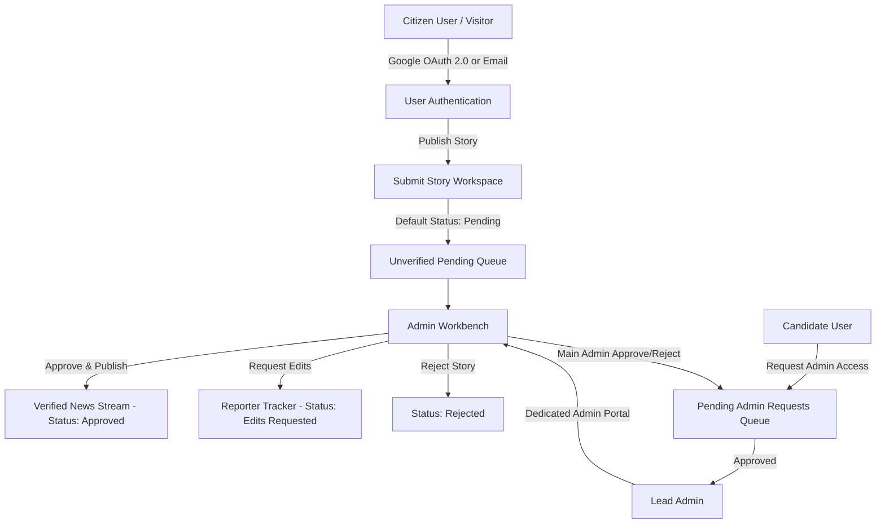

# 📄 PATRIKA — Comprehensive Project Report

**Platform Name**: PATRIKA (Verified Citizen Journalism & Misinformation Detection Engine)  
**Live Production URL**: [https://patrika-3k8yxlv2k-rahul-mishras-projects-85685b15.vercel.app/](https://patrika-3k8yxlv2k-rahul-mishras-projects-85685b15.vercel.app/)  
**GitHub Repository**: [https://github.com/Mishrasays1/PATRIKA.git](https://github.com/Mishrasays1/PATRIKA.git)  
**Database**: MongoDB Atlas Cluster (`cluster0.tfjeynj.mongodb.net/patrika`)  
**Technology Stack**: Node.js, Express.js, React.js, Tailwind CSS, Lucide Icons, Google OAuth 2.0, JWT Authentication  

---

## 1. Executive Summary

**PATRIKA** is an advanced, real-time citizen journalism and misinformation detection web application designed to empower everyday citizens to report ground-level news, civic infrastructure issues, environmental crises, and local governance events while ensuring high information integrity.

By combining **crowdsourced community validation** (Truth/False voting), **strict Admin Fact-Checking Verification**, **multi-platform sharing**, and real-time **Key Performance Indicator (KPI) metrics**, PATRIKA combats fake news and misinformation while keeping readers informed with ground-verified facts.

---

## 2. Problem Statement & Core Objectives

### The Problem
Traditional news outlets often miss hyper-local, ground-level stories, while open social media platforms frequently amplify unverified rumors, deepfakes, and misinformation due to a lack of structured verification workflows and community accountability mechanisms.

### Core Objectives
1. **Empower Citizen Reporters**: Provide an effortless publisher workspace to upload ground stories, local coordinates, and photo evidence.
2. **Prevent Misinformation Spread**: Enforce strict verification workflows where user-submitted stories remain marked as **`⏳ Unverified (Pending Review)`** until vetted by an authorized Admin.
3. **Restricted & Transparent Admin Governance**: Ensure that only developer-approved Lead Admins can review pending queue items, approve/reject ground reports, delete fraudulent posts, and manage candidate access requests.
4. **Community Fact-Checking & Engagement**: Allow readers to vote **Truth** or **False** in 0ms real-time, flag misinformation with custom reasons, and track real-time platform KPIs.

---

## 3. Core Workflows & User Roles



### 1. Citizen Reporter Flow
- **Registration / Login**: Authenticate seamlessly via Google OAuth 2.0 or Email/Password. User profile, avatar, username, and location are persisted in MongoDB Atlas.
- **Submit Story**: Fill in headline, ground location, category, summary, content body, and attach photo evidence (local file upload or web URL).
- **Track Verification Status**: Access **`My Tracker`** (`ReporterDashboard.jsx`) to observe submission lifecycle status (`Pending`, `Approved`, `Edits Requested`, `Rejected`) and read admin reviewer notes.
- **View Published Stories**: Read verified news articles, participate in community discussions, and share reports across external platforms.

### 2. Admin & Fact-Checker Flow
- **Dedicated Admin Login**: Sign in via a dedicated Admin Portal (`AdminLogin.jsx`).
- **Review Submissions**: Vets pending citizen stories inside the **Admin Workbench** (`VerificationDesk.jsx`).
- **3-Button Action Engine**:
  - 🟢 **`Approve & Publish`**: Elevates story status to `approved`, assigns high trust score (95%), and publishes live to the main stream.
  - 🟡 **`Request Edits`**: Reverts story to `edits_requested` with custom reviewer notes so the reporter can provide additional evidence.
  - 🔴 **`Reject Story`**: Rejects misleading or false submissions.
- **Platform Moderation & Post Deletion**: Lead Admins possess absolute power to delete any post across the platform to eliminate spam or harmful content.
- **Admin Candidate Approval**: Main Admins review candidate requests in **`Admin Access Requests`** and approve or reject candidates to grant full admin powers.

---

## 4. Data Requirements & Schemas

### 1. User Data Schema (`server/models/User.js`)
| Field Name | Type | Description |
| :--- | :--- | :--- |
| `name` | String | User full display name |
| `username` | String | Unique handle (e.g. `@rahul_mishra`) |
| `email` | String | Unique email address |
| `role` | String | `'reporter'`, `'reader'`, or `'admin'` |
| `isAdminVerified` | Boolean | `true` if officially approved as Lead Admin |
| `adminApprovalStatus` | String | `'none'`, `'pending'`, `'approved'`, or `'rejected'` |
| `adminRequestReason` | String | Explanation provided when requesting Admin access |
| `location` | String | User ground location or city |
| `reputationScore` | Number | Trust score based on accurate reporting (default: 90) |
| `badges` | Array | Earned badges (e.g. `'Verified User'`, `'Verified Admin'`) |

### 2. Story Data Schema (`server/models/Story.js`)
| Field Name | Type | Description |
| :--- | :--- | :--- |
| `title` | String | Story headline |
| `summary` | String | Brief excerpt or summary |
| `content` | String | Full detailed report body text |
| `location` | String | Ground reporting location coordinates |
| `category` | String | Topic (`Civic Infrastructure`, `Environment`, etc.) |
| `media` | Array | Attached photo evidence objects (`{ url, type, caption }`) |
| `status` | String | `'pending'`, `'approved'`, `'rejected'`, `'edits_requested'` |
| `trustScore` | Number | Calculated trust score percentage (0 - 100%) |
| `trustLevel` | String | `'High Confidence'`, `'Medium Confidence'`, `'Unverified'` |
| `reporter` | ObjectId | Reference to `User` schema |
| `reviewerNotes` | String | Admin reviewer feedback comments |
| `upvotes` | Number | Count of community **Truth** votes |
| `downvotes` | Number | Count of community **False** votes |
| `votes` | Array | Audit log of user vote choices (`[{ userId, voteType }]`) |
| `comments` | Array | Reader comments (`[{ userId, userName, userAvatar, text }]`) |

### 3. Misinformation Report Schema (`server/models/Report.js`)
| Field Name | Type | Description |
| :--- | :--- | :--- |
| `storyId` | ObjectId | Target story being flagged |
| `reporterId` | ObjectId | User submitting the flag report |
| `reporterName` | String | Name of user flagging the story |
| `reason` | String | Categorized reason (`Inaccurate Data`, `Manipulated Media`, etc.) |
| `details` | String | Custom explanation details |

---

## 5. Key Performance Indicators (KPIs)

PATRIKA calculates and displays 5 live KPIs on the main news dashboard (`server/routes/statsRoutes.js`):

```
+---------------------------------------------------------------------------------------------------+
|  Stories Submitted  |  % Verified Content  |  Engagement Rate  |  Accuracy & Trust  | Active Contributors |
|       [ 12 ]        |       [ 88% ]        |      [ 85% ]      |      [ 92% ]       |        [ 4 ]        |
+---------------------------------------------------------------------------------------------------+
```

1. **Number of Stories Submitted**: Total count of citizen reports submitted across the platform.
2. **Percentage of Verified Content**: \(\frac{\text{Approved Stories}}{\text{Total Stories}} \times 100\).
3. **User Engagement Rate**: \(\frac{\text{Total Votes} + \text{Total Comments}}{\text{Total Stories}} \times 100\).
4. **Accuracy and Trust Score**: Average trust score computed across all published stories.
5. **Active Contributors**: Total number of unique citizen reporters and fact-checkers.

---

## 6. Key System Architecture & Engineering Highlights

### 1. Unified MERN Stack Architecture
- **Frontend**: Single Page Application (SPA) built with React 18, Vite, and Tailwind CSS.
- **Backend API**: Node.js & Express RESTful API server.
- **Database**: MongoDB Atlas cloud database with Mongoose ORM models.

### 2. Real-time Fail-Proof 0ms Optimistic UI & Locking Mechanics
- **Problem Solved**: High-frequency background data synchronization caused UI button state reversions during rapid clicking.
- **Solution**: Implemented `isUserInteractingRef` lock protection in `AppContext.jsx`. When a user clicks **Truth**, **False**, **Approve**, or **Delete**, background polling is locked for 1.5 seconds, guaranteeing 0ms optimistic UI rendering without server overwrites.

### 3. Multi-Platform Sharing & Deep-Linking System
- Integrated `ShareModal.jsx` enabling 1-click sharing across:
  - 📋 **Direct Link Copy** (with instant clipboard feedback)
  - 💬 **WhatsApp**
  - 🐦 **X (Twitter)**
  - 📘 **Facebook**
  - ✉️ **Email**
  - 📱 **Device Native Share API** (`navigator.share`)
- Supports deep-link URL parsing (`?story=STORY_ID`), directing readers straight to the shared report on boot.

---

## 7. RESTful API Reference

### Story Management (`/api/stories`)
- `GET /api/stories`: Fetch all stories (filterable by category, status, search)
- `GET /api/stories/:id`: Fetch single story detail and increment view counter
- `POST /api/stories`: Create new citizen story (default status: `pending`)
- `PUT /api/stories/:id/status`: Admin update story status (`approved`, `rejected`, `edits_requested`)
- `DELETE /api/stories/:id`: Delete story (Author or Lead Admin power)
- `POST /api/stories/:id/vote`: Submit or toggle **Truth** / **False** vote

### Authentication & Admin Governance (`/api/auth`)
- `POST /api/auth/register`: User email registration
- `POST /api/auth/login`: User email login
- `POST /api/auth/google`: Verify real Google OAuth 2.0 credential token
- `POST /api/auth/admin/register`: Submit Admin access request
- `POST /api/auth/admin/login`: Verified Admin portal login
- `GET /api/auth/admin/requests`: Fetch pending admin candidates
- `POST /api/auth/admin/decide-request`: Main Admin approve/reject admin candidate
- `PUT /api/auth/profile/:id`: Update user profile details

---

## 8. Deployment & Environment Configuration

### Vercel Deployment Settings
- **Frontend Build Command**: `npm run build`
- **Output Directory**: `dist`
- **API Server Route Rewrite**: Serverless API functions routed under `/api/*`.

### Production Environment Variables
- `MONGODB_URI`: MongoDB Atlas connection string (`mongodb+srv://...`)
- `JWT_SECRET`: `patrika_jwt_secret_2026`
- `GOOGLE_CLIENT_ID`: OAuth 2.0 Client ID

---

## 9. Verification & Summary

| Module / Requirement | Status | Verification Note |
| :--- | :--- | :--- |
| **Citizen Reporter Workflow** | ✅ Completed | Submission, photo upload, tracking dashboard active |
| **Verification & Admin Flow** | ✅ Completed | 3-button review desk (Approve/Edit/Reject) working |
| **Restricted Admin Security** | ✅ Completed | Master Admin seed & Admin Candidate Approval system live |
| **5 Live Platform KPIs** | ✅ Completed | Dashboard widget calculating 5 metrics real-time |
| **Multi-Platform Sharing** | ✅ Completed | 1-click direct link, WhatsApp, X, FB & deep-linking working |
| **Fail-Proof 0ms UI** | ✅ Completed | Polling lock prevents button state reversions |

*Report generated and finalized for production deployment of PATRIKA.*
